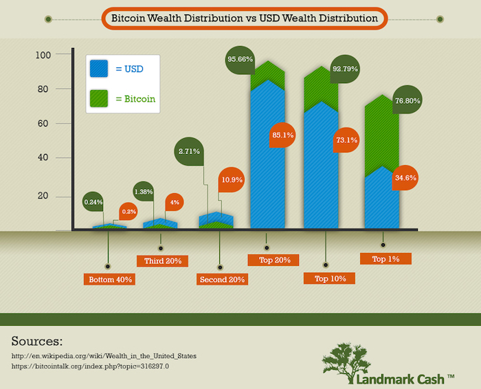
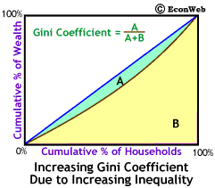
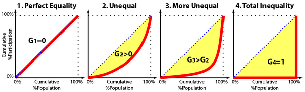

# proofing ground
## for cryptoeconomic simulation
> proofing ground is a simulation framework that evaluates wealth inequality outcomes (as measured by the gini cofficient) under varying parameterized cryptoconomic considerations

# introduction

decentralized systems, such as those used in cryptocurrency, have demonstrated a tendency for centralization of wealth. especially for those systems in which wealth equates to power (i.e. proof of stake), this runs counter to the originating decentralized ethos.

proofing ground aims to examine and discover conditions and mechanisms which may enable greater wealth equality for decentralized systems. wealth inequality is captured by the gini coefficient, a common statistical measure of distributional inequality.

see also:
- [gini coefficients of cryptocurrencies](https://blog.dshr.org/2018/10/gini-coefficients-of-cryptocurrencies.html)
- [cryptocurrency wealth concentration: exploring the problems and possible solutions](https://unhashed.com/cryptocurrency-news/cryptocurrency-wealth-concentration-exploring-problem-possible-solutions/)

# methods

the simulations report the gini coefficient, which is metric used to assess wealth inequality

## parameters
several parameters pertaining to cryptoeconomic systems may be evaluated by proofing ground simulation

- initial issuance
- user behavior (i.e. greed)
- [planned] consensus mechanisms
- [planned] wealth redistribution

## gini coefficient

the gini coefficient is a statistical metric for distributional inequality that may be calculated from a plot of the cumulative percentage of the total wealth (or income) against the cumulative percentage of the participants:

see also:
- [measures of distributional inequality](http://www.econweb.com/texts/current/Mansions/inequality-measure.html)
- [gini coefficient and lorenz curve explained](https://towardsdatascience.com/gini-coefficient-and-lorenz-curve-f19bb8f46d66)
- [list of countries by distribution of wealth](https://en.wikipedia.org/wiki/List_of_countries_by_distribution_of_wealth)

# contact
- [e-mail](mailto:amanda.x@gmail.com)
- [linkedin](https://www.linkedin.com/in/liamanda/)

# license

- [gnu general public license v3.0](https://www.gnu.org/licenses/gpl-3.0.en.html)